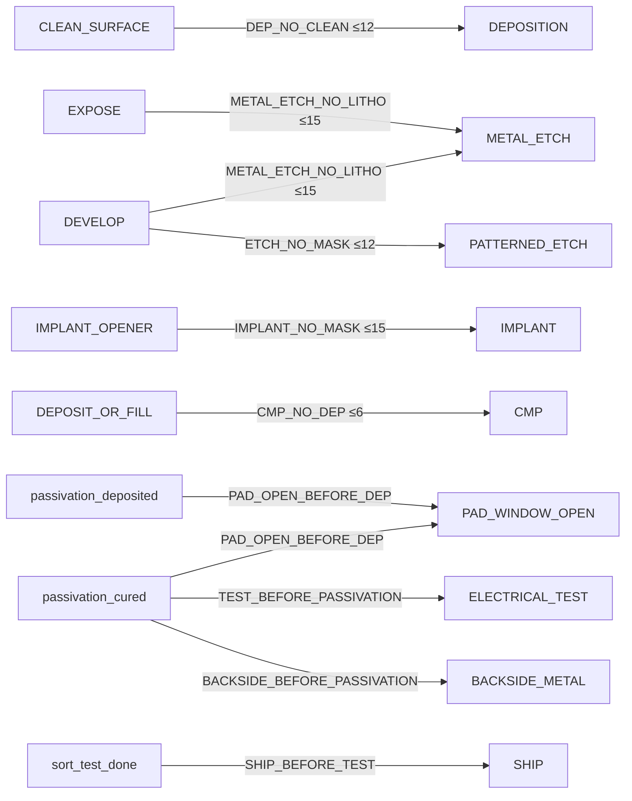

# Process Logic — what the model must learn

_Auto-generated from `physics/process_knowledge.py`. This is the process understanding the system encodes and teaches._

## The canonical fabrication flow

1. **Incoming** — Receive the lot, identify it, inspect and measure the bare wafer.
2. **Pre-clean** — Wet/chemical cleans (RCA, HF dip) remove organics and native oxide — the wafer must be clean before anything is grown.
3. **Substrate prep** — Family-specific: epitaxy (MOSFET/IGBT) or backside grind/clean (IC) to set up the starting material.
4. **First oxidation** — Grow the first thermal oxide; it both protects the surface and provides a clean base for what follows.
5. **Litho–etch–implant cycles** — The heart of the process: for each device region, coat→align→expose→develop resist, etch the opening, strip, clean, implant dopants, anneal. Repeated per mask level in ascending order.
6. **Interlayer dielectric** — Deposit dielectric, densify, CMP flat — the insulating layer between devices and wiring.
7. **Vias** — Litho + etch contact holes through the dielectric, then fill with barrier/seed/metal and CMP.
8. **Metallisation** — Deposit metal, pattern it with full lithography, etch, strip, clean — the interconnect wiring.
9. **Passivation** — Deposit and cure the protective top layer, then open windows to the bond pads.
10. **Backside** — Thin the wafer and form the backside contact — only after the front is sealed.
11. **Test & ship** — Final clean and inspection, electrical + sort test, then release and ship — never before sort.

## The dependency graph (each arrow = a rule)

## Why each rule exists (the physics)

- **RULE_DEP_NO_CLEAN** — `DEPOSITION` needs `CLEAN_SURFACE` within 12 steps. Thin-film deposition nucleates on the existing surface; contamination from a prior etch or handling becomes buried defects. A clean, well-defined surface must exist shortly before any deposition. This is universal to all thin-film processes, which is why it transfers to unseen families.
- **RULE_METAL_ETCH_NO_LITHO** — `METAL_ETCH` needs `EXPOSE` within 15 steps. Metal patterning needs an exact resist image: exposure writes the latent image, development turns it into a physical mask. Both must be present and recent, or the etch clears the whole metal layer.
- **RULE_ETCH_NO_MASK** — `PATTERNED_ETCH` needs `DEVELOP` within 12 steps. Etchants attack every exposed surface. Developed resist physically shields what must survive. Without it the etch removes material uniformly and no device geometry is defined.
- **RULE_IMPLANT_NO_MASK** — `IMPLANT` needs `IMPLANT_OPENER` within 15 steps. Oxide and resist block implant ions; doping only reaches the substrate through a recently opened window. Without one, doping is misplaced or absent.
- **RULE_CMP_NO_DEP** — `CMP` needs `DEPOSIT_OR_FILL` within 6 steps. CMP polishes material down to a target plane. With no overburden it grinds into the underlying structure.
- **RULE_PAD_OPEN_BEFORE_DEP** — `PAD_WINDOW_OPEN` needs `passivation_deposited` (ordering). The pad-window etch opens access to the bond pads through the passivation. The layer must exist and be cross-linked (cured) first, or the etch attacks the metal/dielectric beneath.
- **RULE_TEST_BEFORE_PASSIVATION** — `ELECTRICAL_TEST` needs `passivation_cured` (ordering). Probe needles contact the pads; without cured passivation sealing the interconnects and active areas, probing causes contamination, leakage and irreversible damage.
- **RULE_SHIP_BEFORE_TEST** — `SHIP` needs `sort_test_done` (ordering). Sort test screens defective dice. Shipping first sends untested, possibly defective product to the customer.
- **RULE_BACKSIDE_BEFORE_PASSIVATION** — `BACKSIDE_METAL` needs `passivation_cured` (ordering). Backside metallisation subjects the wafer to reactive sputtering, thermal stress and handling; without cured passivation the finished front-side devices delaminate, crack, or get contaminated.

- **RULE_LITHO_LEVEL_SKIP** — A mask level is skipped or decreases. Each lithography level patterns features that register to structures built by the previous level. Skipping a level means those structures and alignment marks were never created; decreasing a level would overwrite completed structures.