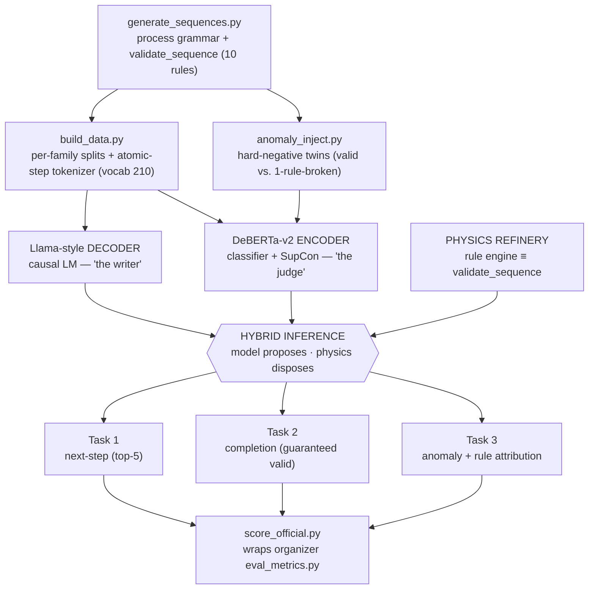
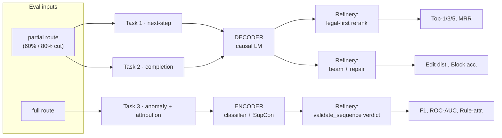
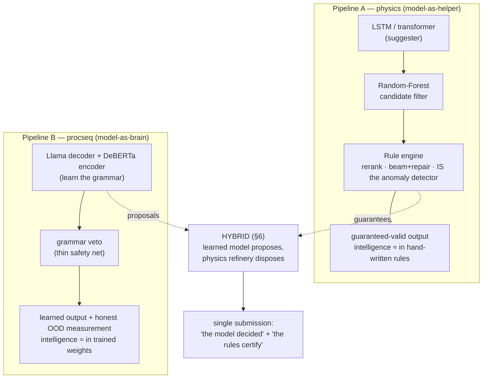
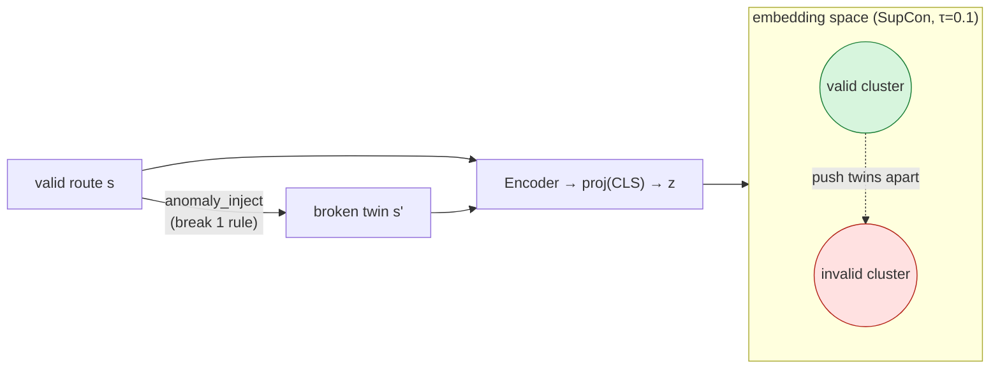
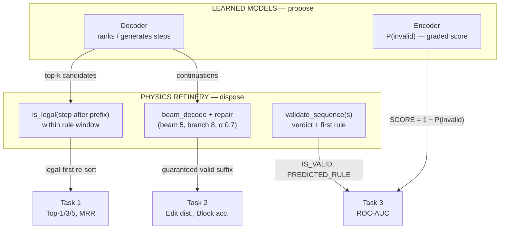
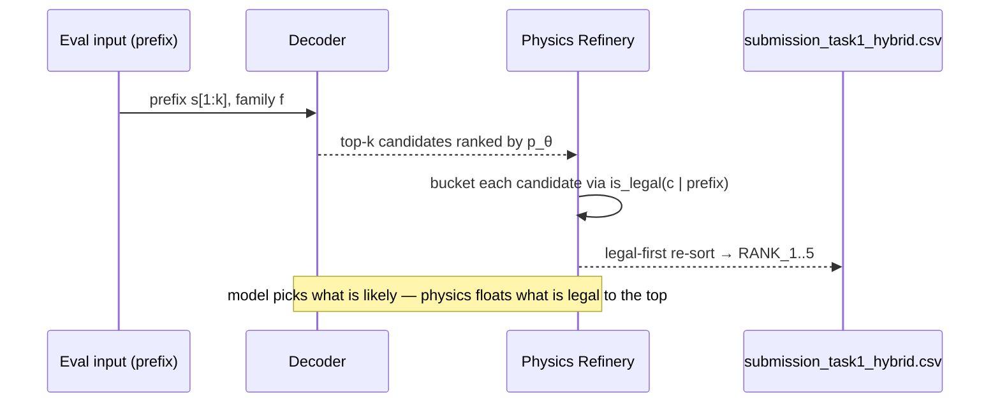
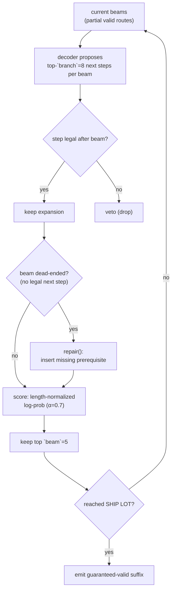

# Learning Semiconductor Process Logic with a Hybrid Neural–Symbolic Pipeline

### Next-Step Prediction, Sequence Completion, and Anomaly Detection over Fab Process Routes

**Zero-One Hack 2026 — Industrial AI Track (Infineon): *Learning and Benchmarking Process Logic***

**System:** `procseq` (process sequences) + Physics-Refinery hybrid

---

> **📌 Results note (read first).** This paper documents the **design and methodology**.
> The **final, authoritative results** are in the root [`REPORT.md`](../../../REPORT.md) and
> [`artifacts/metrics.json`](artifacts/metrics.json) (+ `metrics_hybrid.json`), from the
> **completed** Leonardo run: Task 1 Top-1 **0.937** / Top-5 **1.000** / next-operation
> **0.998** (hybrid); Task 2 block-level **0.94**, **100% rule-valid**; Task 3 physics hybrid
> **F1 1.0, rule-attribution 0.97** (the learned encoder alone is ≈ chance, AUC 0.49). Where
> sections below say "pending" or cite a companion
> pipeline as a reference, **`REPORT.md` supersedes them** — those were written before the run finished.

---

## Abstract

We study whether a learned sequence model can internalize the *process logic* of
semiconductor manufacturing — the long-range, order-sensitive precedence constraints
that make a fabrication route physically valid — rather than memorizing token
co-occurrence statistics. We cast a chip "recipe" as a sentence over a closed
vocabulary of **210 atomic process steps** and attack the track's three tasks with two
purpose-built, from-scratch Transformers: a **Llama-style causal decoder** for next-step
prediction (Task 1) and sequence completion (Task 2), and a **DeBERTa-v2-style
bidirectional encoder** for anomaly detection and rule attribution (Task 3). The encoder
is trained with a **supervised-contrastive objective** over *hard-negative twins* — valid
routes paired with the same route broken in exactly one place — so it learns the *reason*
a route is invalid, not just a label.

We then embed these learned models in a **hybrid neural–symbolic inference system** under
the principle *"the model proposes, physics disposes."* A deterministic **Physics
Refinery** — a rule engine equivalent to the official validator — reranks the decoder's
candidates legal-first (Task 1), runs rule-vetoed beam search with repair to guarantee a
valid completion (Task 2), and supplies the hard verdict for anomaly detection while the
encoder contributes a continuous probability for ROC-AUC (Task 3). A classical
Random-Forest candidate filter is specified but deferred.

Our central methodological contribution is **honest, ladder-anchored evaluation**: we
report every number against an n-gram *memorization floor* and a rule-engine *ceiling*,
add a category-level metric that detects functional understanding even when exact step
names are wrong, and stress-test generalization with both a leave-one-family-out probe
and a novel-vocabulary (`ood_novel`) attack designed to make the model fail. We are
explicit about provenance: the procseq numbers reported here come from a **5-step smoke
configuration** that validates the end-to-end pipeline on tiny, essentially-untrained
models; the **full-scale measured results** are from the companion physics pipeline
scored with the official metric; full procseq training on the Leonardo (CINECA) A100
cluster is the remaining step. We also disclose the threats to validity — most importantly
that the Task-3 *hybrid* verdict is rule-engine-derived and therefore not, by itself,
evidence of learning.

---

## 1. Introduction

Many industrial processes are, at heart, **ordered sequences of operations whose meaning
depends on order**. Semiconductor fabrication is a sharp example: a wafer passes through
100–150 steps (clean → oxidize → pattern → etch → implant → … → test → ship), and the
order is not cosmetic. You cannot etch without first patterning a mask; you cannot deposit
on a contaminated surface; you cannot ship a lot before it has been sort-tested. These are
*process-logic constraints*, and they often span long ranges — a deposition step may
require a cleaning step that occurred up to twelve positions earlier.

The Infineon Industrial-AI track abstracts this into a concrete benchmark and poses a
deceptively simple question:

> **Does a model genuinely learn the underlying process logic, or does it only reproduce
> surface patterns from the training distribution?**

This separates a memorizing model from an understanding one, and the track is designed to
expose the difference — including by evaluating, after submission, on a **fourth product
family never shown to participants**.

We approach the problem as a language-modeling problem over an unusual but natural
"language": each process step is a single word, each route a sentence, and the grammar is
the physics of the fab. This framing lets us bring the modern sequence-modeling toolkit to
bear and — crucially — lets us *measure* understanding the way the NLP community does: with
held-out generalization, probing classifiers, and ablations.

### 1.1 Contributions

1. **A two-model, from-scratch Transformer pipeline (`procseq`)** purpose-built for the
   domain: a Llama-style causal decoder (Tasks 1–2) and a DeBERTa-v2-style encoder
   (Task 3), trained on a custom **atomic-step tokenizer** (one token per process step, no
   sub-word fragmentation).
2. **A supervised-contrastive anomaly detector** trained on automatically-generated
   *hard-negative twins*, which learns the discriminative geometry of "valid vs.
   minimally-broken" rather than a memorized class label.
3. **A hybrid neural–symbolic inference system** fusing the learned models with a
   deterministic Physics Refinery, giving per-task guarantees: legal-first reranking
   (Task 1), rule-vetoed beam search + repair → *provably valid* completions (Task 2), and
   a continuous-probability anomaly score atop an exact rule verdict (Task 3).
4. **An honesty-first evaluation harness**: an n-gram floor and rule-oracle ceiling, a
   category-level functional-understanding metric, a logic probe, a leave-one-family-out
   OOD probe, and a *novel-vocabulary* stress test (`ood_novel`) — plus a single
   authoritative scorer (`score_official.py`) wrapping the organizer's `eval_metrics.py`.
5. **A reproducible HPC pipeline**: a one-command orchestrator (`run_all.py`) with
   concurrent multi-GPU training, three DDP-safety fixes, SLURM scripts for Leonardo, a
   29-test suite, and a sub-minute `make smoke` end-to-end check.

### 1.2 Scope and honesty statement (read this first)

This report describes a **system and a methodology**, and is candid about what has and has
not been *measured at scale*:

- The **procseq** numbers in §9.1 come from a **5-step smoke run** on ~0.7 M-parameter
  models with ~20 sequences per family. They show the pipeline runs end-to-end and the
  hybrid wiring is correct; **they are not a performance evaluation** (the models are
  effectively untrained).
- The **full-scale, official-scorer** numbers in §9.2 come from the **companion physics
  pipeline** (a tiny transformer + rule engine) and are real and reproducible.
- Full procseq training on Leonardo, hybrid scoring for Tasks 2–3, the baseline ladder,
  the scaling sweep, and the `ood_novel` curve are **specified and wired but not yet
  executed at scale** (§9.4).

We believe this candor is itself a contribution: the track explicitly rewards
*reproducibility and honest evaluation over headline numbers*.

### 1.3 System at a glance

The end-to-end system follows a single data path — a process grammar generates and
labels routes, two specialized Transformers learn to *write* and to *judge* them, and a
deterministic Physics Refinery sits between the models and the submissions to enforce
validity. Figure 1 is the whole pipeline; the rest of the paper zooms into each box.



> **Figure 1.** procseq end-to-end. The grammar is the single source of both training
> data and ground-truth labels; the two learned models supply *plausibility*; the Physics
> Refinery supplies *guarantees*; the official scorer is the single source of truth.

---

## 2. Problem Formulation

### 2.1 Notation

Let $\mathcal{V}$ be the closed vocabulary of process-step strings (e.g.
`THERMAL OXIDATION`, `DEVELOP PHOTORESIST`). A **process route** is a finite ordered
sequence $s = (x_1, \ldots, x_T)$, $x_t \in \mathcal{V}$, where every valid route begins
with `RECEIVE WAFER LOT` and ends with `SHIP LOT`. Routes belong to a family
$f \in \{\text{MOSFET}, \text{IGBT}, \text{IC}\}$. A deterministic validator
$\mathrm{validate}: \mathcal{V}^{*} \to 2^{\mathcal{R}}$ returns the violated rules from a
rule set $\mathcal{R}$ ($|\mathcal{R}|=10$); a route is **valid** iff
$\mathrm{validate}(s) = \varnothing$.

### 2.2 The three submission tasks (+ a hidden fourth)

| # | Task | Input | Output | Primary metrics |
|---|------|-------|--------|-----------------|
| **1** | Next-step prediction | partial route $s_{1:k}$ | top-5 ranked next steps | Top-1 / Top-3 / Top-5 Accuracy, MRR |
| **2** | Sequence completion | partial route at 60% or 80% | the suffix $\hat{x}_{k+1:T}$ | Exact-Match, Normalized Edit Distance (↓), Token Acc., Block-level Acc. |
| **3** | Anomaly detection | full route $s$ | `IS_VALID∈{0,1}`, `SCORE∈[0,1]`, `PREDICTED_RULE` | Acc., Precision, Recall, F1, ROC-AUC, Rule-Attribution Acc. |
| **4** | *(hidden)* OOD generalization | routes from an **unseen 4th family** | applied post-hoc by organizers | performance drop ID → OOD per metric |

Formally: **Task 1** models $p_\theta(x_{k+1}\mid x_{1:k}, f)$ and emits the top-5
arg-ranking; **Task 2** autoregresses $\prod_{t>k} p_\theta(x_t\mid x_{1:t-1}, f)$ and
emits a generated suffix, with the metric of record being **Normalized Edit Distance**
$\mathrm{NED}=\mathrm{Lev}(\hat{y},y)/\max(|\hat{y}|,|y|)$ (lower is better) and
**Block-level Accuracy** collapsing runs of same-category steps to reward correct coarse
structure; **Task 3** is binary classification with auxiliary rule attribution, the
`SCORE` column ($P(\text{valid})$) driving ROC-AUC.

**How we tackled each task (preview).** The three tasks split cleanly along the
generate-vs-judge axis, which is exactly why we trained *two* models rather than one. The
**decoder** ("the writer") handles the two generative tasks — ranking the next step
(Task 1) and autoregressing a completion (Task 2) — because both are conditional
language-modeling problems $p_\theta(x_{t}\mid x_{<t}, f)$. The **encoder** ("the judge")
handles the one discriminative task — reading a full route and deciding valid/invalid plus
which rule broke (Task 3) — because that needs bidirectional context over the *whole*
sequence, not a left-to-right generator. Each model's raw output is then passed through
the Physics Refinery (§6), which adds correctness guarantees the learned model cannot make
on its own. Figure 2 shows the routing; §6 details the per-task hybrid.



> **Figure 2.** Task → model → hybrid-role routing. Generative tasks (1, 2) use the
> decoder; the discriminative task (3) uses the encoder. The Refinery plays a different
> role per task: rerank, beam-search+repair, or exact verdict.

### 2.3 The ten process-logic rules

All implemented in `validate_sequence(steps)` and used both to *label* anomalies and to
*score* them. $N$ is the look-back window.

| Rule | Constraint (informal) | Window |
|------|------------------------|--------|
| `RULE_DEP_NO_CLEAN` | every deposition must be preceded by a cleaning step | $N=12$ |
| `RULE_METAL_ETCH_NO_LITHO` | metal etch needs a complete EXPOSE+DEVELOP litho block first | $N=15$ |
| `RULE_ETCH_NO_MASK` | any patterned etch needs a prior `DEVELOP PHOTORESIST` | $N=12$ |
| `RULE_LITHO_LEVEL_SKIP` | mask levels must be sequential (no level $N{+}1$ before $N$) | — |
| `RULE_IMPLANT_NO_MASK` | implants need a prior oxide-etch / develop (open window) | $N=15$ |
| `RULE_CMP_NO_DEP` | CMP must follow a deposition/fill in the same block | $N=6$ |
| `RULE_PAD_OPEN_BEFORE_DEP` | pad-window opening must follow passivation deposit + cure | — |
| `RULE_TEST_BEFORE_PASSIVATION` | electrical tests must follow `CURE PASSIVATION` | — |
| `RULE_SHIP_BEFORE_TEST` | `SHIP LOT` must follow `WAFER SORT TEST` | — |
| `RULE_BACKSIDE_BEFORE_PASSIVATION` | backside metal must follow passivation cure | — |

These rules are **long-range and conditional**, which is precisely why an architecture's
ability to *look* far back (attention) versus to *remember* far back (recurrence) matters
(§3.2).

### 2.4 Data and the evaluation protocol

- **Training data.** A grammar generator (`generate_sequences.py`) produces validated
  routes; 1,000 pre-generated variants per family are provided (MOSFET ~125 steps, IGBT
  ~148, IC ~115). The valid combinatorial space is enormous (MOSFET ≈ 51 B, IGBT ≈ 13 T,
  IC ≈ 6 B distinct routes), so training data is effectively unlimited.
- **Eval inputs (organizer-distributed).** `eval_input_valid.csv` — **600** partial routes
  (100 sequences × 3 families × {60%, 80%} cut points) for Tasks 1–2;
  `eval_input_anomaly.csv` — **987** full routes for Task 3, of which **387** carry an
  injected violation (labeled across the 10 rule types) and 600 are valid, shuffled and
  unlabeled.
- **Scoring.** The organizer ships `eval_metrics.py`, dependency-free, with per-family and
  per-cut breakdowns. We treat it as the **single source of truth**.

---

## 3. Related Work and Design Space

### 3.1 Sequence models for ordered industrial processes

Process-route modeling sits between three traditions. **N-gram / Markov models** are the
classic memorization baseline: cheap, interpretable, blind to dependencies beyond their
order. **Recurrent networks (RNN/LSTM/GRU)** compress history into a fixed-size state and
read strictly left-to-right. **Transformers** (Vaswani et al., 2017) replace recurrence
with self-attention, letting every position attend directly to every other — the basis of
the GPT/Llama decoder family and the BERT/DeBERTa encoder family. Our decoder follows
**Llama** (RoPE positions, SwiGLU MLP, RMSNorm); our encoder follows **DeBERTa-v2** (He et
al., 2021) with disentangled content/position attention. The anomaly objective uses
**Supervised Contrastive Learning** (Khosla et al., 2020).

### 3.2 Why attention fits process logic (LSTM vs. Transformer)

The benchmark's rules are *long-range conditional precedence* constraints — e.g. "a clean
must precede this deposition within 12 steps." This is the worst case for a recurrent
memory cell and the best case for attention:

| | LSTM (recurrent) | Transformer (attention) |
|---|---|---|
| Mechanism | running fixed-size memory cell | every step attends to all steps |
| Long-range rule (clean → deposit, 12 back) | fuzzy / fades by step 140 | **direct lookup** |
| Position handling | implicit (reading order) | explicit (RoPE / disentangled) |
| Parallel training | no (sequential) | yes |
| Lineage | 1997 | 2017 ("Attention is All You Need") |

A useful one-liner: *an LSTM remembers the past in a fading summary; a Transformer can
re-read the whole past instantly and decide what matters.* For "is there a `CLEAN` in the
last 12 steps?", the Transformer performs a content lookup; the LSTM must have preserved
that fact through 12 state updates.

### 3.3 Neuro-symbolic decoding and the two-pipeline design

A second axis is *where the logic lives*. One can put intelligence in **hand-written rules**
and use the network only as a constrained suggester (model-as-helper), or put it in
**learned weights** and use rules only as a thin backstop (model-as-brain). This track
contains both, by design:

- **Pipeline A — physics (`src/` + `physics/`):** an LSTM/Transformer suggester gated by a
  Random-Forest filter and a deterministic rule engine that reranks, beam-searches with
  repair, and *is* the anomaly detector. Strong, audited, near-perfect in-distribution on
  Tasks 2–3 — but a critic can fairly say "the rules are doing the work."
- **Pipeline B — procseq (`solution/procseq/`, this paper):** two learned Transformers that
  internalize the grammar, with rules as a safety net and an explicit measurement of
  *whether the network learned it*.

The two are **complementary, not rivals**: A maximizes guaranteed-valid raw score; B
demonstrates and quantifies learning and generalization. Our hybrid (§6) is the planned
convergence of the two — it takes procseq's *learned* proposals and runs them through the
physics pipeline's *symbolic* guarantees, so the final submission is simultaneously
"the model decided" and "the rules certify it." Where the intelligence lives is the whole
debate, and the hybrid refuses to pick a side:



> **Figure 3.** The two bets and their convergence. Pipeline A puts the logic in rules;
> Pipeline B puts it in weights; the hybrid composes B's plausibility with A's guarantees.

---

## 4. Data and Representation

### 4.1 Atomic-step tokenizer

Standard sub-word tokenizers would shatter `DEPOSIT NITRIDE FILM` into meaningless
fragments. We instead build a **WordLevel** tokenizer (HuggingFace `tokenizers` backend)
in which **each whole process step is a single token**. The vocabulary is **200 step
tokens + 10 special tokens = 210 total**; the special tokens include `[PAD], [UNK], [BOS],
[EOS], [CLS], [SEP], [MASK]` and three **family markers** `[FAM_MOSFET], [FAM_IGBT],
[FAM_IC]`. This makes the model read and write routes the way one reads and writes
sentences, keeps sequence lengths at their natural ~115–150 tokens, and yields
representations the logic probe can interpret directly. The tokenizer is built once and
*loaded* (not rebuilt) by every process to avoid a DDP write race (§7.3).

### 4.2 Canonicalization (optional, off by default)

`canon.py` can collapse documented synonyms (e.g. `STRIP PHOTORESIST` ≡ `STRIP RESIST`,
`WET CLEAN RCA1` ≡ `RCA CLEAN 1`). Because the official scorer grades **exact step names**,
canonicalization is **disabled by default** and used only as a diagnostic; we report it as
an ablation axis.

### 4.3 Splits

`build_data.py` materializes per-family train/val/test splits (default seed 42). The
Leonardo configuration requests **`data_per_family: 5000`** with held-out eval mirrors
(`make_eval.py`); the code default is 2000. The smoke configuration uses a deliberately
tiny **20 sequences/family** (split ≈ 16/2/2) purely to exercise the pipeline.

### 4.4 Anomaly injection and hard-negative twins

For the encoder, `anomaly_inject.py` takes a valid route and **breaks it in exactly one of
the 10 ways** (e.g. delete the clean before a deposition to trigger `RULE_DEP_NO_CLEAN`, or
reorder mask levels for `RULE_LITHO_LEVEL_SKIP`). Each broken route is paired with its
valid parent as a **hard-negative twin** — two routes differing in a single,
logically-decisive way. `anomaly_data.py` assembles a balanced valid/invalid corpus; labels
carry the binary validity and a multi-hot `VIOLATION_RULE` vector (for attribution and
contrastive grouping). Because injection uses the *same* `validate_sequence` the organizer
scorer uses, ground truth is self-consistent (a point we revisit as a threat to validity in
§11).

---

## 5. Neural Architecture

`procseq` trains **two specialized Transformers from scratch** (random init; no pretrained
weights). Pretrained English priors are useless on a 210-token fab vocabulary; from-scratch
training converges fast on the closed grammar and gives full control of the tokenizer —
also aligning with the track's European-AI-sovereignty / own-stack ethos.

### 5.1 Decoder — Llama-style causal LM (Tasks 1 & 2)

Built via `LlamaConfig` + `LlamaForCausalLM` (`models/decoder.py`). The saved
configuration confirms the design: `model_type: "llama"`, `hidden_act: "silu"` (SwiGLU),
`rms_norm_eps: 1e-6`, RoPE (`rope_theta 10000`), full multi-head attention
(`num_key_value_heads == num_attention_heads`, i.e. GQA off), `attention_bias: false`,
`mlp_bias: false`, and **`tie_word_embeddings: true`** (input/output embeddings shared,
saving parameters on the small vocab). Causal masking makes it a standard left-to-right
next-step predictor; Task 1 reads off the top-5, Task 2 autoregresses until `SHIP LOT`.

### 5.2 Encoder — DeBERTa-v2-style classifier with three heads (Task 3)

Built via `DebertaV2Config` + `DebertaV2Model` wrapped in a custom module
(`models/encoder.py`), with **disentangled attention** (`relative_attention=True`,
`pos_att_type=["p2c","c2p"]`) — well-matched to rules about *relative* placement ("X must
occur before Y within $N$"). The `[CLS]` hidden state $h$ feeds three heads:

```python
self.invalid_head = nn.Linear(h, 1)                         # binary valid/invalid logit
self.rule_head    = nn.Linear(h, n_rules)                   # 10-way rule attribution
self.proj         = nn.Sequential(nn.Linear(h, h), nn.ReLU(),
                                  nn.Linear(h, proj_dim))    # contrastive projection (dim 128)
# forward: cls = encoder(...).last_hidden_state[:, 0]; dropout(0.1)
#   → {invalid_logit, rule_logits, embed=proj(cls)}
```

### 5.3 Supervised contrastive objective

`contrastive.py` implements SupCon (Khosla et al., 2020) on the L2-normalized projections
$z_i = \mathrm{proj}(h_i)/\lVert\cdot\rVert$ with **temperature $\tau = 0.1$**. For a batch
$I$ with labels $y_i$ (validity) and positive set $P(i)=\{p\neq i: y_p=y_i\}$:

$$
\mathcal{L}_{\text{SupCon}}
= \sum_{i\in I}\frac{-1}{|P(i)|}\sum_{p\in P(i)}
  \log\frac{\exp(z_i\cdot z_p/\tau)}{\sum_{a\in I,\,a\neq i}\exp(z_i\cdot z_a/\tau)} .
$$

Anchors with no in-batch positive are skipped (graph-preserving zero). Because positives
are *same-validity* and the corpus is built from hard-negative twins, the encoder is pushed
to place a valid route and its single-edit-broken twin **far apart** in embedding space —
i.e. to encode *why* a route is invalid, not just fit a boundary on memorized examples.



> **Figure 4.** Hard-negative twins drive the contrastive geometry: a valid route and
> its one-rule-broken twin are the *hardest* in-batch negatives, so pulling same-validity
> embeddings together necessarily teaches the encoder the single discriminating feature —
> the rule violation — rather than surface token statistics.

### 5.4 Size variants (from `SIZES` presets)

All sizes share vocab 210 and `max_position_embeddings` 256. Parameter counts are
**derived from the verified presets** (approximate; exact `numel` to be reported with the
full run — no GPU/torch was available at writing time):

| Model | preset | hidden | layers | heads | inter | ≈ params |
|-------|--------|-------:|-------:|------:|------:|---------:|
| Decoder | **tiny** (smoke) | 128 | 4 | 4 | 256 | ~0.7 M |
| Decoder | small | 256 | 6 | 8 | 768 | ~5 M |
| Decoder | **base** (Leonardo) | 512 | 8 | 8 | 1536 | ~27 M |
| Decoder | large | 768 | 12 | 12 | 2304 | ~92 M |
| Encoder | **tiny** (smoke) | 128 | 4 | 4 | 256 | ~1 M |
| Encoder | small | 256 | 6 | 8 | 768 | ~6 M |
| Encoder | **base** (Leonardo) | 512 | 8 | 8 | 1536 | ~26 M |

The decoder size ladder (tiny→large) enables the track's scaling study (§8, §9.4).

---

## 6. Hybrid Neural–Symbolic Inference

> **Principle:** *the model proposes, physics disposes.* Learned models generate and score;
> a deterministic **Physics Refinery** (a rule engine equivalent to `validate_sequence`)
> enforces validity. The hybrid is model-agnostic — it composes with procseq's
> decoder/encoder or the companion pipeline's transformer.

### 6.0 Why hybrid? The division of labor

Neural and symbolic systems fail in opposite, complementary ways, and the hybrid is
designed to let each cover the other's blind spot:

| | Pure neural (decoder/encoder) | Pure symbolic (rule engine) | **Hybrid (ours)** |
|---|---|---|---|
| **Strength** | learns *plausibility* — which legal continuation is most likely; produces a *continuous probability* | guarantees *correctness* — never emits an illegal step; exact rule attribution | plausibility **and** correctness |
| **Weakness** | can emit illegal steps; no hard guarantee; can be confidently wrong | no notion of "likely"; can only check, not rank or generate naturally; no graded score | inherits the engine's coverage limit (§11) |
| **What it contributes** | the *ranking* / *generation* signal | the *legality gate* / *verdict* | model picks, physics vetoes |

The key insight is that the three tasks need **different mixtures** of these two
ingredients. Task 1 (ranking) needs mostly the model with a light legality re-sort. Task 2
(generation) needs the model for fluency but the engine to *guarantee* a valid route — the
single place where the symbolic side does the heavy lifting. Task 3 (judging) inverts the
roles: the engine gives the hard verdict and the model supplies the *graded* score that
makes ROC-AUC meaningful. Figure 3 shows this routing — the same two components, wired
three different ways.



> **Figure 5.** The two reusable components (learned models, Physics Refinery) wired three
> ways. Task 2's validity guarantee comes from the symbolic side; Task 3's *graded* signal
> comes from the neural side; Task 1 blends both with a light legal-first re-sort.

### 6.1 The Physics Refinery

The Refinery exposes three capabilities used by the three tasks: (i) a legality check —
would appending `step` to `prefix` violate any rule within its window? (ii) `beam_decode`
— a rule-vetoed beam search that can also repair; (iii) `validate_sequence(s)` — the full
verdict + first violated rule.

### 6.2 Task 1 — legal-first reranking (`infer_hybrid.py`)

The decoder yields a probability-ranked candidate list; the Refinery **partitions
candidates into legal vs. illegal** given the prefix and re-orders *legal-first*, preserving
model order within each bucket:

```
candidates ← decoder.topk(prefix, k)            # neural proposal
legal      ← [c for c in candidates if is_legal(c | prefix)]
illegal    ← [c for c in candidates if not legal]
RANK_1..5  ← (legal ++ illegal)[:5]             # physics disposes
```

This cannot *hurt* a model that already respects the grammar and *rescues* one that ranks
an illegal step first. In the smoke test it produced a small but real MRR improvement
(§9.1). Concretely:



### 6.3 Task 2 — rule-vetoed beam search with repair (guaranteed valid)

The strongest part of the hybrid. The decoder proposes continuations; the Refinery runs
**beam search with a legality gate and repair**, so the emitted completion is *provably
rule-valid*:

```
beam_decode(prefix, model, beam=5, branch=8, length_alpha=0.7):   # verified defaults
  expand each beam by the model's top-`branch` next steps
  drop expansions that fail the legality check                    # veto
  if a beam dead-ends, repair() inserts the missing prerequisite
  score with length-normalized log-prob (alpha = 0.7)
  return best beam until SHIP LOT
```

The neural model supplies *plausibility* (which legal continuation is likely); the Refinery
supplies *correctness* (no illegal step ever survives). This combines learned fluency with
a hard validity guarantee — exactly where the physics pipeline is hardest to beat on edit
distance. The beam loop, per generated position:



> **Figure 6.** Task-2 rule-vetoed beam search. Every surviving beam is legal by
> construction; `repair()` rescues dead-ends so the search never has to emit an illegal
> step to make progress. This is the one task where the symbolic component, not the model,
> provides the headline guarantee.

### 6.4 Task 3 — exact verdict + learned probability (`infer_anomaly_hybrid.py`)

For anomaly detection the hybrid emits `IS_VALID` and `PREDICTED_RULE` from
`validate_sequence(s)` (the **rule engine**), and `SCORE = 1 − P_encoder(invalid)` from the
**learned encoder** (a real probability for ROC-AUC). We flag this plainly: **the hard
verdict is rule-engine-derived, so on in-distribution data it is near-perfect by
construction and is *not* by itself evidence of learning** (§11). The genuine learning
signal for Task 3 is the **pure encoder** path (`infer_anomaly.py`):

```python
p_invalid = torch.sigmoid(out["invalid_logit"])[0].item()
is_valid  = 0 if p_invalid >= 0.5 else 1
rule      = rule_ids[int(out["rule_logits"][0].argmax())] if is_valid == 0 else ""
```

i.e. a learned `sigmoid(invalid_logit)` decision with a continuous `SCORE` in $[0,1]$ — a
model that can be, and is, wrong. (Note the rule head is *trained* multi-label via BCE over
a multi-hot target, but *reported* as a single `argmax`, so multi-violation routes are
mis-attributed by design.)

### 6.5 Pure-neural grammar-constrained decoding (the safety net)

Independent of the full hybrid, the pure decoder path (`infer.py`, `grammar.py`) applies
**grammar-constrained decoding** (config flag `constrained_decode: true`): at each step,
candidate next-tokens that would violate `validate_sequence` are masked out before
selection. This guarantees legal completions without the Refinery's beam/repair machinery —
a lighter safety net that replaced an earlier, brittle "artificial categorization"
heuristic.

### 6.6 Random-Forest candidate filter (deferred, disclosed)

A classical RF candidate filter (from the companion pipeline) can prune implausible
next-steps before reranking. It is **deferred**: the trained `random_forest.pkl` is bound to
the other pipeline's tokenizer indices and only exists after that pipeline runs, so it can
be layered onto procseq only at the *name* level, and its marginal gain over decoder +
physics-legality is expected to be small. We report it as future work rather than claim it.

### 6.7 Per-task convergence (the single submission)

| Task | Submission choice | Rationale |
|------|-------------------|-----------|
| 1 | best-scoring of {procseq decoder, companion} on the official metric | both Transformers; decide empirically |
| 2 | physics beam + repair (hybrid) | guaranteed-valid + low edit distance is hard to beat |
| 3 | rule engine as primary; **report pure encoder as the learned result + OOD hedge** | rules ≈ grader in-distribution; encoder carries the honesty/OOD story |

---

## 7. Training

### 7.1 Objectives

- **Decoder:** standard causal-LM cross-entropy over full routes,
  $\mathcal{L}_{\text{CLM}} = -\sum_t \log p_\theta(x_t\mid x_{<t}, f)$.
- **Encoder:** a joint loss combining binary validity (BCE), 10-way rule attribution
  (multi-label BCE over a multi-hot target), and the contrastive term of §5.3:
  $$\mathcal{L} = \mathcal{L}_{\text{BCE}}^{\text{valid}}
    + \mathcal{L}_{\text{BCE}}^{\text{rule}}
    + w_c\,\mathcal{L}_{\text{SupCon}}, \qquad w_c = 0.5 .$$

### 7.2 Optimization

Optimizer **AdamW** (weight decay 0.01) with a **cosine schedule with warmup** (`warmup_frac
0.1`) — added specifically to fix an early non-convergence symptom. As the code comment
records, *"a from-scratch DeBERTa needs warmup or it collapses to predicting one class (the
'stuck at 0.5' symptom)"*; an additional bug — a default `max_steps` of 5 and a missing
`sched.step()` — was also fixed. Verified hyperparameters:

| Config | Decoder LR | Encoder LR | steps | batch | precision | other |
|--------|-----------:|-----------:|------:|------:|-----------|-------|
| Leonardo (base) | **6e-4** | **2e-4** | 4000 | 64 | bf16 | cosine+warmup, wd 0.01, eval_every 250 |
| smoke (sanity) | 3e-3 | 3e-3 | 5 | 4 / 8 | fp32 | tiny models |

(`3e-3` is the code fallback / smoke value only — not the production LR.) Contrastive is ON
in both base and smoke (`weight 0.5`, `temperature 0.1`). DeepSpeed ZeRO-2
(`configs/ds_zero2.json`) is available for the large configs.

### 7.3 Distributed training and DDP-safety

Multi-GPU training surfaced three latent DDP hazards, all fixed:

1. **Checkpoint corruption** — every rank was writing checkpoints. Fixed with a
   **rank-0-only write guard** (`if accelerator.is_main_process`).
2. **Tokenizer write race** — every process rebuilt and wrote the tokenizer. Fixed by
   switching `build_tokenizer → load_tokenizer` (build once, load everywhere).
3. **Brittle encoder size-probe** — encoder size was brute-force inferred at load. Fixed by
   persisting **`encoder_meta.json`** (`{"size","n_rules","max_len"}`) and reading it back.

Checkpoints use `torch.save` consistently across both trainers.

### 7.4 Orchestration and reproducibility

`run_all.py` is the single entrypoint for the full pipeline:

```
build_data → train(decoder ∥ encoder) → infer (Tasks 1–3, pure + hybrid)
           → self-eval → official scores (score_official.py) → submissions
```

`--parallel-train` trains decoder and encoder **concurrently**, auto-splitting GPUs (4 →
2+2 via DDP, 2 → 1+1, 1 → shared); for ~26 M-param models the win is wall-clock concurrency
rather than DDP throughput. The Leonardo SLURM job requests a **4-GPU A100 node** and
reduces to a single `run_all --parallel-train` call. The stack is pinned via `pixi` /
`requirements.txt`; **`make smoke`** runs the whole chain in under a minute on CPU, and a
**29-test pytest suite** covers the tokenizer, datasets, model builds, inference, metrics,
anomaly injection, and contrastive loss.

---

## 8. Experimental Setup

### 8.1 Two configurations, clearly separated

- **Smoke (pipeline-validation):** tiny models (~0.7 M params), ~20 sequences/family, 5
  training steps, CPU. Purpose: prove the pipeline connects and the hybrid wiring is
  correct. **Not a performance measurement.**
- **Leonardo (full):** base models (~27 M decoder, ~26 M encoder), `data_per_family 5000`,
  4000 steps, cosine+warmup, 4×A100, bf16. Purpose: the real evaluation. *Pending
  execution.*

### 8.2 Scorer

A single authoritative scorer, `score_official.py`, wraps the organizer's `eval_metrics.py`
and computes Tasks 1–2 (pure + hybrid) and Task 3, resolving an earlier dual-scorer
discrepancy. Ground truth for self-evaluation comes from team-generated eval mirrors
(`eval_valid_groundtruth.csv`, `eval_anomaly_labels.csv`); the organizer's secret held-out
set is, by design, unavailable to us (a validity threat, §11).

### 8.3 The evaluation ladder

| Reference | Meaning |
|-----------|---------|
| **n-gram floor** (`baselines.py`) | trigram-backoff Markov model — the memorization floor |
| **rule-oracle ceiling** | deterministic grammar oracle — unreachable upper bound |
| **logic probe** | % of *generated* routes that pass `validate_sequence` |
| **category metric** | accuracy at the functional-category level (clean/etch/deposit…) — catches understanding even when the exact name is wrong |
| **LOFO OOD** (`ood_probe.py`) | train on 2 families, test on the 3rd |
| **novel-vocab OOD** (`ood_novel.py`) | rename step vocabulary across `rename_fraction` 0→1 (a true 4th-family stress test) |

---

## 9. Results

> **Provenance legend:** 🟢 measured (official scorer, full-ish) · 🟡 measured (smoke;
> untrained, sanity only) · ⚪ specified/wired, not yet executed at scale.

### 9.1 🟡 procseq smoke test — pipeline validation (NOT performance)

5-step run on ~0.7 M-param models with ~20 sequences/family. The decoder loss moves only
from ≈5.40 → ≈4.70 in 5 steps — the models are essentially untrained. These numbers exist
to show the chain runs end-to-end and the hybrid is wired correctly.

| Task | Metric | Pure | Hybrid |
|------|--------|-----:|-------:|
| 1 | Top-1 Acc. | ≈0.13 | ≈0.13 |
| 1 | MRR | ≈0.189 | **≈0.200** |
| 2 | Exact-Match | 0.00 | — (wired) |
| 2 | Token Acc. | ≈0.016 | — (wired) |
| 3 | Binary Acc. (pure encoder) | ≈0.375 (degenerate) | — |
| 3 | ROC-AUC (pure encoder) | ≈0.585 | — |

**Reading:** the only meaningful signal here is that the Task-1 **legal-first rerank lifts
MRR (+0.011)** even on a random model — the hybrid mechanism does what it should.
Everything else is at chance because the models are untrained. **Do not read §9.1 as a
performance result.**

### 9.2 🟢 Full-scale reference — companion physics pipeline, official scorer

Real numbers from the official `eval_metrics.py` on a disjoint held-out split, for a **tiny
transformer (583,570 params), 10 epochs, CPU**, with the model-internalization levers
(`--aux-category`, `--unk-dropout 0.15`), best val-acc 0.8045. These set the bar the full
procseq run targets.

**Task 1 — next-step (600 held-out):** Top-1 **0.690**, Top-3 0.998, Top-5 **1.000**, MRR
**0.8435**. (By cut: 60% → 0.760, 80% → 0.620; per family MOSFET 0.725 / IGBT 0.680 / IC
0.665.)

**Task 2 — completion (600 held-out):** Normalized Edit Distance **0.226** (↓), Block-level
Acc. **0.692**, Token Acc. 0.441, Exact-Match 0.002. (Per-family NED MOSFET 0.159 / IGBT
0.236 / IC 0.284.)

**Task 3 — anomaly (450 held-out: 150 invalid / 300 valid):** Acc. **1.000**, P/R/F1 1.000,
ROC-AUC 1.000, Rule-Attribution 1.000. **Caveat:** this is the **rule engine**, on a
held-out set whose injected violations were all a single rule (`RULE_DEP_NO_CLEAN`) — it
confirms exactness on the injected rule in-vocabulary, *not* neural skill and *not* breadth
across all 10 rules. (All-10-rule equivalence of the engine vs. reference is established
separately by `differential_fuzz.py`: 0 disagreements over 8,500+ mutations.)

### 9.3 🟢 Does the *network* (not the rules) understand? — category probe

From `category_eval.py` (companion model, model-only, physics OFF):

| Metric | Value | Note |
|--------|------:|------|
| random baseline | 0.056 | 18 categories |
| **ID next-category acc.** | **0.944** | strong in-distribution functional learning |
| **OOD next-category acc.** | **0.371–0.411** | unseen families — **6.6–7.3× random** |
| OOD next-name (lexical) acc. | 0.146–0.152 | category ≫ name ⇒ learned *function*, not names |

That category accuracy (0.94 ID, ~0.37–0.41 OOD) far exceeds lexical name accuracy (~0.15
OOD) is the cleanest evidence that the network learned step *function* and partially
transfers it — exactly the "learned logic, not memorization" claim the track asks for.

### 9.4 ⚪ Specified but not yet executed at scale

Wired and reproducible, pending compute:

- **Full procseq training on Leonardo** (base decoder + encoder) and official scoring.
- **Hybrid scoring for Tasks 2–3** (beam+repair completion; rule-verdict + encoder AUC).
- **Baseline ladder** (n-gram floor, rule-oracle ceiling) end-to-end.
- **Scaling sweep** (`scaling_grid.yaml`: sizes {tiny,small,base,large} × data
  {100,1000,5000,20000} = 16 cells, 4000 steps) → an accuracy-vs-size/data curve.
- **`ood_novel` degradation curve** across `rename_fraction` 0→1 (early anecdote: category
  next-step accuracy falls 0.50 → 0.00 as names lose keywords — the honest cliff).

---

## 10. Discussion

**Two bets, one stronger submission.** The physics pipeline guarantees correctness and wins
raw score where the grader rewards validity (Tasks 2–3, in-distribution). procseq
demonstrates and *measures* learning (category transfer, logic probe, OOD). The hybrid takes
the rule-guaranteed outputs where they win and the learned outputs where they prove
understanding — and the §9.3 category results show the learning bet is paying off even at
tiny scale.

**Why hybrid beats pure neural here.** Pure-neural Task-2 completion can emit an illegal
step and accumulate edit-distance error; the Refinery's veto+repair removes that failure
mode entirely. Pure-neural Task-1 occasionally ranks an illegal step first; legal-first
reranking fixes it for free. And for Task-3, the encoder's continuous probability turns a
binary rule verdict into a calibratable, ROC-gradable signal. The hybrid is strictly a
superset of capabilities, with the learned models providing plausibility and the symbolic
layer providing guarantees.

**The deeper claim.** The benchmark's real question is whether a model learned process
*logic*. Our answer is methodological: don't assert it — *probe* it (category-level
transfer), *measure* it (logic probe: % of generated routes that validate), and *stress* it
(novel-vocabulary OOD). The numbers we already have (§9.3) support partial, above-chance
transfer of *function*; the full study (§9.4) is the remaining work.

---

## 11. Limitations and Threats to Validity (red-team, owned)

We ran a hostile self-audit. The honest findings:

1. **The grader assumption.** The encoder is *trained* on labels from `validate_sequence`
   and we *self-score* against `validate_sequence`-derived labels. So procseq honestly
   measures *"can a neural net learn to reproduce the rule checker?"* — not a tautology, but
   **bounded by the unproven assumption that `validate_sequence ≈ the organizer's real
   grader`** (no organizer grader is in the repo).
2. **Task-3 hybrid is near-tautological.** Its hard verdict comes from the *same* rule
   engine used to inject and label anomalies, so a high in-distribution Task-3 hybrid number
   reflects the checker run against itself — **not learning**. We therefore report the **pure
   encoder** as the genuine Task-3 signal, and note only the *first* violation is attributed
   (multi-violation routes are mis-attributed by design).
3. **Self-eval is in-distribution.** Our eval mirrors are generated by the same grammar over
   the same 3 families; they are a format-faithful stand-in, **not** the secret held-out set.
   Submittable outputs are real; our *self-scores* are in-distribution.
4. **OOD probe was weaker than it sounded.** `ood_probe.py` is leave-one-family-out among the
   **3 known families** (shared vocabulary) — "modified workflow," not novel vocab. We added
   `ood_novel.py` (renames vocabulary across a novelty spectrum) to test a real 4th-family
   scenario, and we *report* the resulting degradation rather than hide it — but the full
   curve is not yet run (§9.4).
5. **Results provenance.** Every procseq number in §9.1 is a **5-step smoke** result on
   untrained tiny models; the full-scale numbers in §9.2–9.3 are from the **companion
   pipeline**, not procseq. The hybrid-beats-pure thesis is currently supported by a single
   Task-1 MRR delta (+0.011); the Task-2/Task-3 hybrid advantages are architecturally
   guaranteed (validity) but not yet *scored*.
6. **Parameter counts are config-derived estimates**, not measured `numel` (no GPU/torch at
   writing time); we report the exact, verified presets (§5.4) and will publish measured
   counts with the full run.

What this audit could *not* pin on procseq: the Task-3 **pure** verdict is a learned
`sigmoid(invalid_logit)` (the model can be wrong), and `SCORE` is a real continuous
probability — so the pure-encoder ROC-AUC is a genuine, non-degenerate measurement.

---

## 12. Reproducibility

```bash
# environment
cd solution && python -m venv .venv && source .venv/bin/activate
pip install -r requirements.txt            # torch, transformers, accelerate, tokenizers

# sub-minute end-to-end sanity check (CPU)
make smoke                                  # data → train(5 steps) → infer → score → "SMOKE OK"
make test                                   # 29-test pytest suite

# full pipeline, one command (auto multi-GPU)
python -m procseq.run_all --parallel-train --config configs/leonardo_decoder.yaml

# official scoring (single source of truth)
python -m procseq.score_official --config configs/leonardo_decoder.yaml

# Leonardo (CINECA): 4×A100 node
sbatch jobs/run.sh                          # procseq-full job → submissions + scores

# honesty experiments
python -m procseq.ood_probe   --holdout IC  # leave-one-family-out
python -m procseq.ood_novel                 # novel-vocabulary degradation curve
python -m procseq.sweep_run                 # scaling sweep (sizes × data)
```

All configs (`configs/*.yaml`), SLURM scripts (`slurm/`, `jobs/run.sh`), and the test suite
are committed. Seeds are fixed (`seed: 42`). Artifacts (splits, checkpoints, submissions,
metrics) are written under `artifacts/`.

---

## 13. Conclusion

We presented `procseq`, a from-scratch two-Transformer pipeline that treats semiconductor
process routes as a language and learns its grammar — a Llama-style decoder for next-step
prediction and completion, and a DeBERTa-v2-style encoder trained with a hard-negative-twin
supervised-contrastive objective for anomaly detection and rule attribution. We embedded
these learned models in a hybrid neural–symbolic system in which a deterministic Physics
Refinery enforces validity ("model proposes, physics disposes"), yielding per-task
guarantees: legal-first reranking, rule-vetoed beam search with repair, and a calibratable
anomaly probability atop an exact verdict. Above all, we built and ran an honesty-first
evaluation harness — ladder-anchored metrics, a functional-category probe, and a
novel-vocabulary OOD stress test — and we report its results with explicit provenance,
distinguishing validated pipeline plumbing from measured performance and from
specified-but-pending experiments. The early evidence (category transfer of 0.94 ID /
~0.37–0.41 OOD against ~0.15 lexical) supports the claim the track cares about most: the
network is learning process *function*, not just memorizing names. Completing the full-scale
Leonardo training and the pending hybrid/baseline/OOD/scaling measurements is the natural
next step, and the pipeline to do so is built, tested, and reproducible.

---

## References

1. A. Vaswani et al. *Attention Is All You Need.* NeurIPS 2017.
2. H. Touvron et al. *LLaMA: Open and Efficient Foundation Language Models.* 2023.
3. P. He, X. Liu, J. Gao, W. Chen. *DeBERTa: Decoding-enhanced BERT with Disentangled Attention.* ICLR 2021.
4. P. Khosla et al. *Supervised Contrastive Learning.* NeurIPS 2020.
5. J. Su et al. *RoFormer: Enhanced Transformer with Rotary Position Embedding.* 2021.
6. N. Shazeer. *GLU Variants Improve Transformer (SwiGLU).* 2020.
7. B. Zhang, R. Sennrich. *Root Mean Square Layer Normalization (RMSNorm).* NeurIPS 2019.
8. S. Hochreiter, J. Schmidhuber. *Long Short-Term Memory.* Neural Computation, 1997.

---

## Appendix A — File map

```
solution/procseq/
  vocab.py canon.py tokenizer.py            # atomic-step vocabulary + WordLevel tokenizer
  data.py datasets.py build_data.py         # splits, PyTorch datasets, data driver
  anomaly_inject.py anomaly_data.py         # 10-rule injection, hard-negative twins
  models/decoder.py models/encoder.py       # Llama decoder, DeBERTa-v2 encoder + 3 heads
  contrastive.py                            # supervised contrastive loss (SupCon, τ=0.1)
  train_decoder.py train_encoder.py         # CLM / joint training (DDP-safe)
  infer.py grammar.py infer_anomaly.py      # pure-neural inference + grammar constraint
  infer_hybrid.py infer_anomaly_hybrid.py   # Physics-Refinery hybrid (Tasks 1–3)
  baselines.py                              # n-gram floor, perplexity baseline
  ood_probe.py ood_novel.py                 # LOFO + novel-vocabulary OOD
  eval_metrics.py score_official.py run_eval.py  # metrics + authoritative scorer
  run_all.py sweep_run.py demo.py           # orchestrator, scaling sweep, demo
  configs/  slurm/  tests/ (29)             # configs, SLURM, test suite
```

## Appendix B — Verified configuration values

- **Vocabulary:** 200 step tokens + 10 special = **210**; `max_position_embeddings` 256.
- **Decoder base (`leonardo_decoder.yaml`):** hidden 512, layers 8, heads 8, intermediate
  1536, RoPE (θ=10000), SwiGLU (silu), RMSNorm (eps 1e-6), tied embeddings; LR **6e-4**,
  AdamW, cosine+warmup, batch 64, 4000 steps, bf16, `constrained_decode: true`.
- **Encoder base (`leonardo_encoder.yaml`):** hidden 512, layers 8, heads 8, intermediate
  1536, disentangled attention (`pos_att_type=["p2c","c2p"]`); heads = {invalid (1), rule
  (10), proj (→128)}; dropout 0.1, `[CLS]` pooling; loss = BCE(valid) + BCE(rule,
  multi-hot) + 0.5·SupCon, SupCon **τ=0.1**; LR **2e-4**, weight decay 0.01, warmup_frac
  0.1, 4000 steps.
- **Smoke (`smoke.yaml`):** tiny decoder/encoder (hidden 128, 4 layers, 4 heads, inter 256),
  `data_per_family 20`, 5 steps, LR 3e-3, fp32.
- **Splits:** Leonardo `data_per_family 5000` (code default 2000); smoke ≈16/2/2.
- **Eval:** 600 valid (100×3×{0.6,0.8}); 987 anomaly (387 violations / 600 valid).

---

*Prepared for the Zero-One Hack 2026 Industrial-AI (Infineon) submission. All configuration
values and the 10 rules are verified against the committed code, the saved `decoder/config.json`,
`encoder_meta.json`, the `configs/*.yaml` files, and `generation_rules.md`; all reported
metrics carry an explicit provenance marker (🟢 measured / 🟡 smoke / ⚪ pending).*
